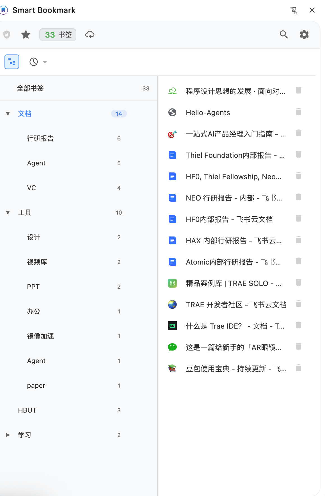

<div align="center">

# Smart Bookmark

一个帮你把书签重新变得“找得到、理得清、愿意继续存”的浏览器扩展。

把“收藏了但找不回来”的网页，重新变成可搜索、可整理、可积累的个人资料库。

[](https://github.com/howoii/SmartBookmark/releases)
[](LICENSE)
[](https://chromewebstore.google.com/detail/smart-bookmark/nlboajobccgidfcdoedphgfaklelifoa)
[](https://microsoftedge.microsoft.com/addons/detail/smart-bookmark/dohicooegjedllghbfapbmbhjopnkbad)

[安装](#安装) · [快速开始](#快速开始) · [开发](#开发) · [常见问题](#常见问题)

[立即安装 Chrome 版](https://chromewebstore.google.com/detail/smart-bookmark/nlboajobccgidfcdoedphgfaklelifoa) · [立即安装 Edge 版](https://microsoftedge.microsoft.com/addons/detail/smart-bookmark/dohicooegjedllghbfapbmbhjopnkbad) · [反馈问题](https://github.com/howoii/SmartBookmark/issues)

</div>

> 适合“收藏很多网页，但真正需要时总是找不回来”的人。

## 这个项目解决什么问题

很多书签工具的问题，不是“存不进去”，而是“以后找不回来”。

Smart Bookmark 主要解决这几件事：

- 收藏之后很快忘记标题，只记得内容
- 书签越存越多，文件夹越分越乱
- 想以后再整理，结果一直没整理
- 已经在 Chrome 里存了很多书签，但很难继续维护
- 想多端同步，但又不想完全依赖第三方平台

## 为什么值得用

- `🔎` 按内容找书签，而不只是按标题找书签
- `🗂️` 先保存、后整理，不用一开始就把分类想得很完整
- `📥` 把 Chrome 里已经积累的书签继续用起来，而不是从零开始
- `🌲` 用层级标签替代越来越难维护的文件夹结构
- `☁️` 支持 WebDAV 同步，在多设备之间保留自己的数据控制权

## 对 AI 时代的帮助

AI 时代的问题，不再只是“信息太少”，而是“信息太多，真正需要时找不到”。

- `📚` 看到的信息越来越多，但真正有价值的内容很容易被淹没
- `🧠` 你常常记得问题和思路，却记不住当时收藏的标题
- `🤖` 你会反复向 AI 提问、找资料、比对方案，所以更需要一个长期可回查的资料入口

它不是替代 AI，而是帮你把“看过的内容”和“以后还会用到的资料”留下来，让搜索、回查和个人积累更顺畅。

## 产品截图

### 书签库与标签树

左侧看标签结构，右侧看书签列表，适合回看和整理已经存下来的资料。



### 标签筛选

按标签层级快速缩小范围，比一层层翻文件夹更高效。


## 适合谁

- `📘` 经常收藏文档、教程、博客、研究资料的人
- `🧾` 收藏很多“以后再看”，但书签已经失控的人
- `💭` 记得内容、不记得标题的人
- `🔐` 希望保留自己数据控制权的人

## 不适合谁

- 只偶尔收藏几个网页，基本不会回头找的人
- 只想要最简单收藏功能，不需要后续整理和搜索增强的人
- 不关心资料积累，也不需要长期回查的人

## 快速开始

### 使用扩展

1. 安装扩展
2. 打开设置页，配置 AI 服务
3. 按 `Ctrl/Cmd + B` 保存当前页面
4. 按 `Ctrl/Cmd + K` 搜索已保存内容

如果你只是想先体验，不需要一开始就把所有功能都配好。先试保存和搜索，确认适合自己的使用方式后，再决定要不要启用 AI 和同步。

第一次使用，建议先体验这两点：

- `⌘/Ctrl + B` 快速保存：看看它能不能减少你保存网页时的整理负担
- `⌘/Ctrl + K` 内容搜索：看看它能不能比传统书签搜索更容易帮你找回资料

### 一个典型使用流程

1. 看到一篇以后可能会用到的文章，先按快捷键保存下来。
2. 扩展自动补标签和摘要，帮你减少当下的整理负担。
3. 过几天再找资料时，直接按你记得的主题或问题搜索。
4. 当同类资料越来越多时，再用标签树慢慢整理，而不是一开始就搭复杂文件夹。

### 导入浏览器书签

如果你已经在 Chrome 里存了很多书签，可以直接导入继续管理。

导入时可以选择：

- 是否保留文件夹路径标签
- 是否智能生成标签
- 是否跳过已导入的书签

导入后，扩展会保存自己的书签数据，不会改动你原来的 Chrome 书签结构。

## 安装

### 应用商店安装

- Chrome `🧩`：<https://chromewebstore.google.com/detail/smart-bookmark/nlboajobccgidfcdoedphgfaklelifoa>
- Edge `🧩`：<https://microsoftedge.microsoft.com/addons/detail/smart-bookmark/dohicooegjedllghbfapbmbhjopnkbad>

### 本地加载

```bash
git clone https://github.com/howoii/SmartBookmark.git
cd SmartBookmark
```

然后在浏览器扩展管理页面中：

1. 打开开发者模式
2. 选择“加载已解压的扩展程序”
3. 选择项目根目录

## 开发

### 本地开发

```bash
git clone https://github.com/howoii/SmartBookmark.git
cd SmartBookmark
npm install
```

然后：

1. 在 Chrome 或 Edge 中加载本地扩展
2. 修改页面脚本或样式后，通常刷新扩展页面即可看到效果
3. 修改 `background.js` 或其他后台逻辑后，重新加载扩展更稳妥
4. 如需调试背景逻辑，在扩展管理页打开 Service Worker 调试

### 项目结构

```text
SmartBookmark/
├── manifest.json
├── background.js
├── popup.html / popup.js
├── quickSave.html / quickSave.js
├── quickSearch.html / quickSearch.js
├── settings.html / settings.js
├── api.js
├── models.js
├── storageManager.js
├── filterManager.js
├── search.js
├── webdavClient.js
├── webdavSync.js
└── _locales/
```

### 贡献

欢迎提交 Issue、改进建议和 Pull Request。

建议 Issue 至少包含这些信息：

- 复现步骤
- 预期结果
- 实际结果
- 浏览器版本
- 截图或录屏

常用提交前缀：

- `feat:` 新功能
- `fix:` 修复问题
- `docs:` 文档更新
- `refactor:` 重构
- `test:` 测试相关

## 常见问题

### 我必须配置 AI 才能使用吗？

不是。基础书签保存、浏览和整理可以单独使用；智能标签、摘要、语义搜索需要可用的 AI 服务。

### 导入会不会影响我原来的 Chrome 书签？

不会。导入动作只会把你选中的内容复制到扩展里继续管理，不会改动 Chrome 原有书签结构。

### 不想用 AI 的时候，还能正常保存书签吗？

可以。只是不会自动生成标签、摘要，也不能使用依赖 AI 的搜索增强能力。

### 能不能同步到别的设备？

可以。项目支持 WebDAV 同步，适合希望自己掌控同步方式的用户。

## 许可证

本项目基于 [MIT License](LICENSE) 开源。
