<div align="center">

# 🔖 Smart Bookmark

**AI-Powered Intelligent Bookmark Manager for Chrome & Edge**

[](https://github.com/howoii/SmartBookmark/releases)
[](LICENSE)
[](https://chromewebstore.google.com/detail/smart-bookmark/nlboajobccgidfcdoedphgfaklelifoa)
[](https://microsoftedge.microsoft.com/addons/detail/smart-bookmark/dohicooegjedllghbfapbmbhjopnkbad)

[安装插件](#-快速开始) · [功能介绍](#-功能特性) · [技术架构](#-技术架构) · [核心业务流程](#-核心业务流程) · [开发指南](#-开发指南) · [贡献指南](#-贡献指南) · [FAQ](#-faq)

</div>

---

## 📖 项目简介

Smart Bookmark 是一个基于 Chrome/Edge 扩展的智能书签管理插件，设计目标是让书签收藏、搜索和跨设备同步更加智能、轻量和可维护。

扩展核心能力包括：AI 自动标签与摘要生成、语义化书签搜索、层级标签结构、WebDAV 同步、以及轻量本地存储策略。

---

## ✨ 功能特性

### 🎯 核心功能

- **AI 自动标签生成**：收藏网页时自动生成语义标签，减少手动分类成本
- **语义搜索**：基于向量嵌入的语义搜索，支持自然语言查询
- **AI 生成摘要**：自动为书签生成摘要，快速预览页面内容
- **多级标签与层级展示**：支持层级标签树、智能归类和标签筛选
- **WebDAV 同步**：支持用户自定义 WebDAV 服务器，实现跨设备书签同步
- **快捷键支持**：`Ctrl/Cmd + K` 为快速搜索，`Ctrl/Cmd + B` 为快速收藏
- **本地数据存储**：书签和缓存信息存储于浏览器本地，保护用户隐私

### 🛠️ 高级功能

- 层级书签展示视图（树形结构、标签筛选、拖拽宽度调整）
- 自定义筛选规则与过滤器
- 批量选择、编辑与删除书签
- 书签导入与导出
- 多 AI 服务支持：OpenAI、通义千问、智谱 GLM、Ollama、本地自定义 API
- 支持浅色/深色主题

---

## 📸 截图演示

<div align="center">

### 快速保存界面
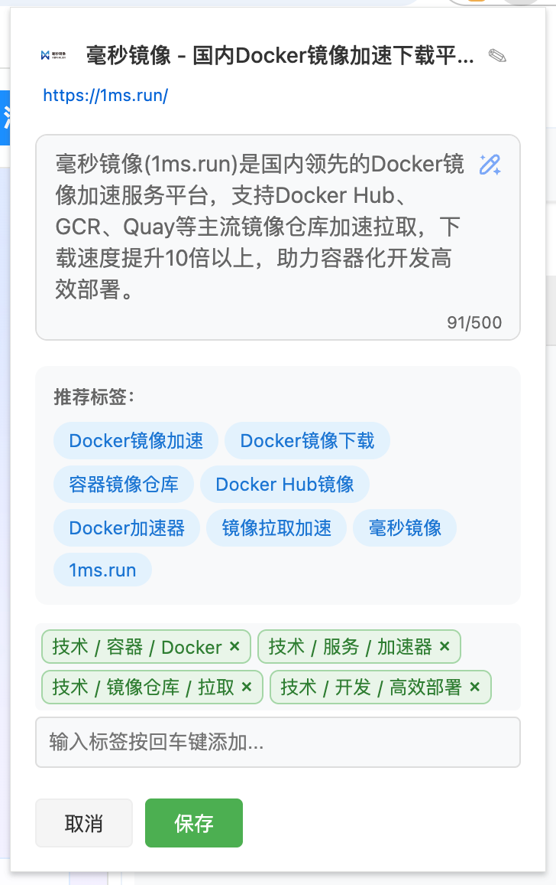

### 搜索结果界面
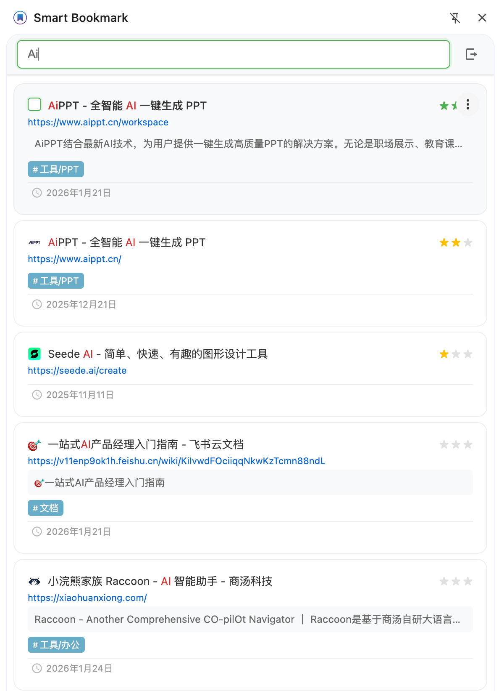

### 层级标签与筛选
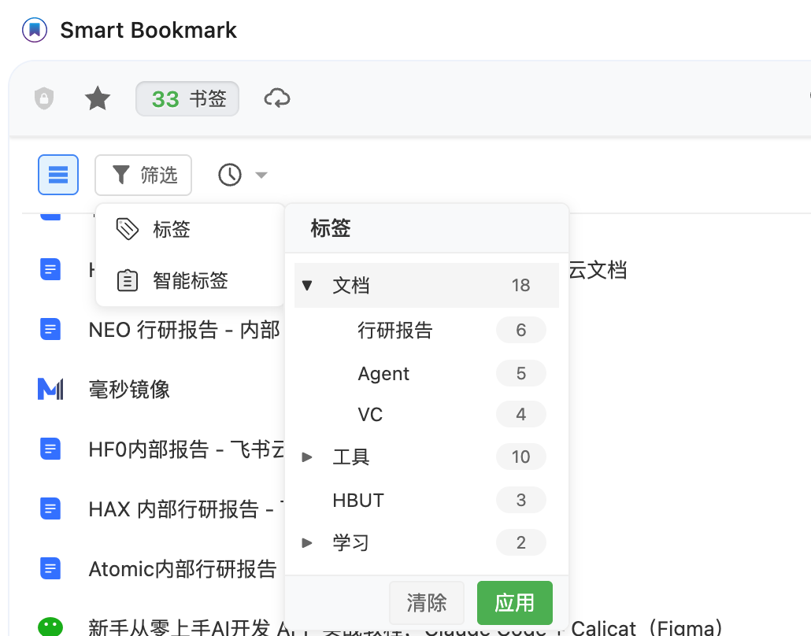

### 导入与导出
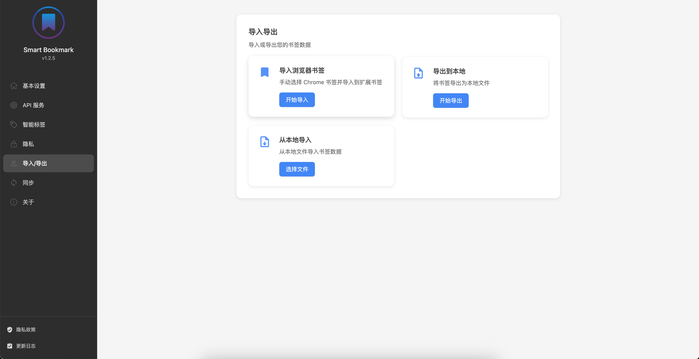

### 导入浏览器书签
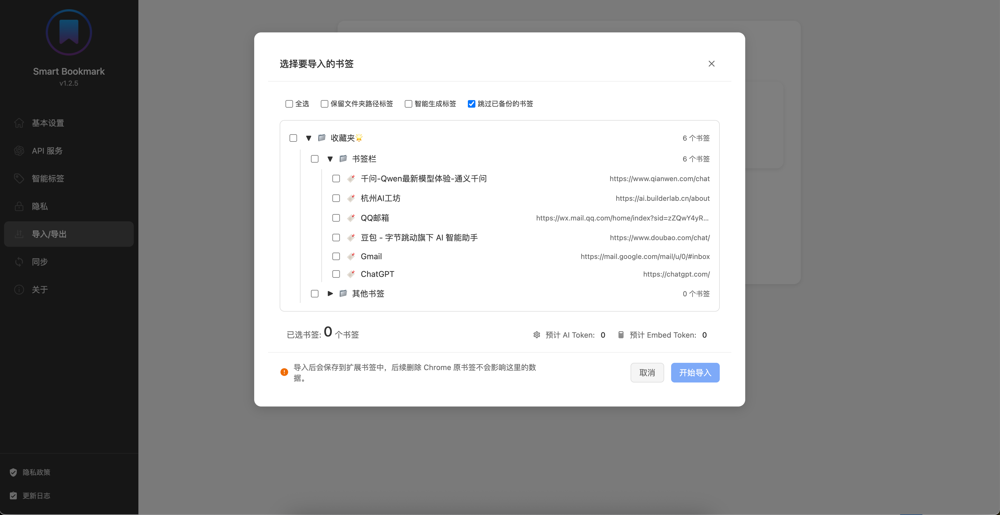

### WebDAV 同步设置
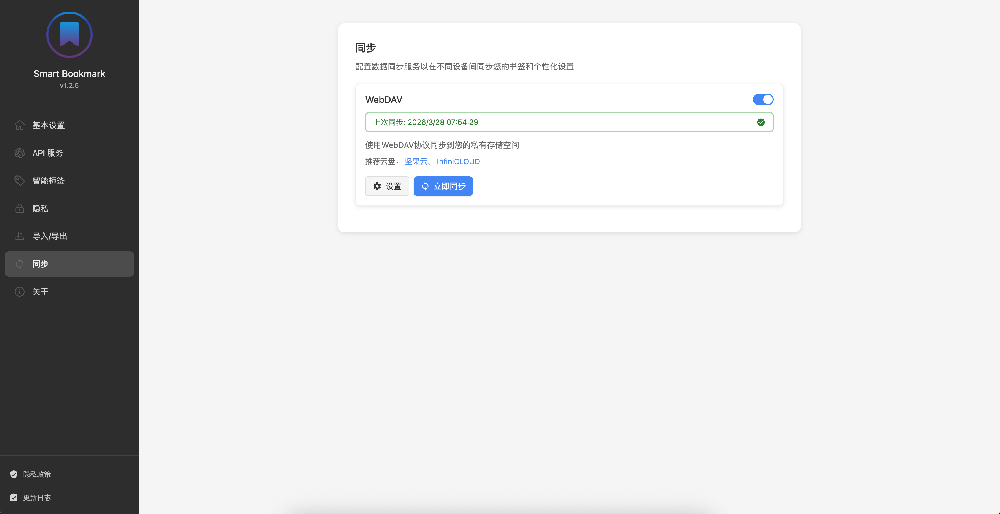

### AI 服务配置
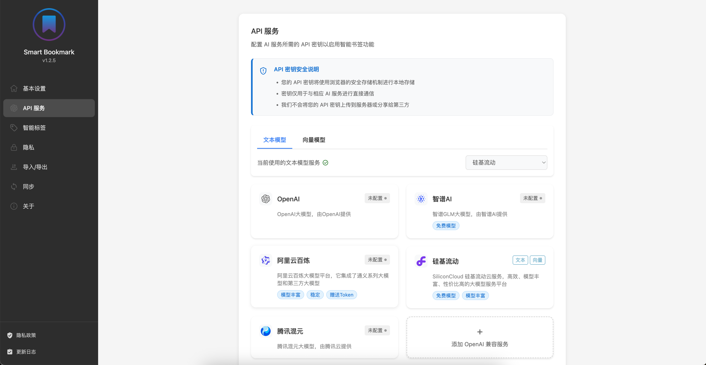

### 基本设置
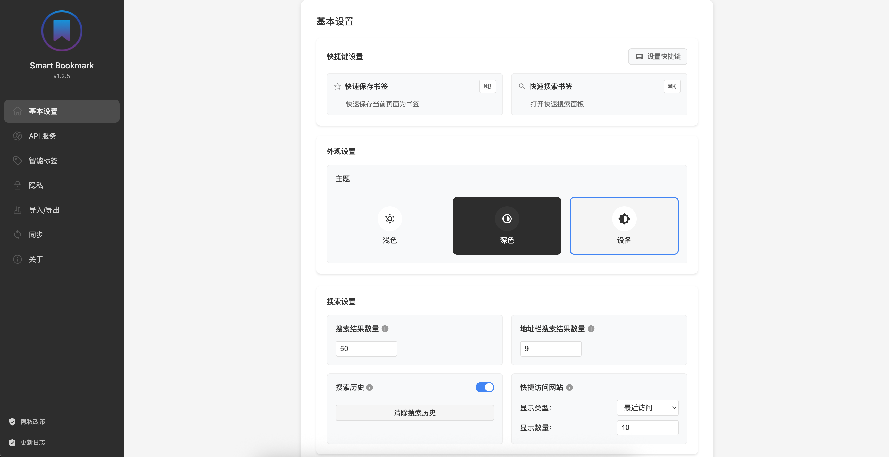

### 隐私保护
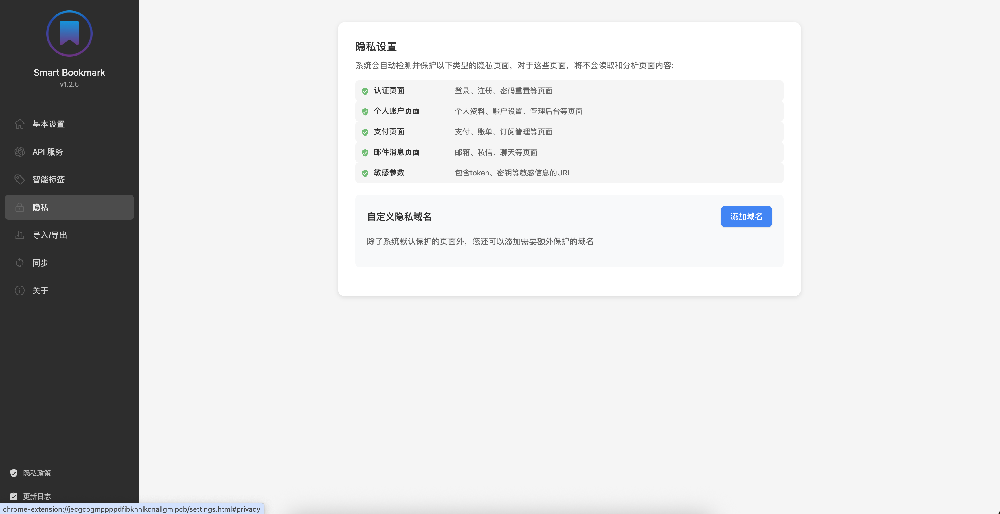

</div>

---

## 🏗️ 技术架构

Smart Bookmark 基于 Chrome 扩展 Manifest V3 架构设计，主流程使用 Service Worker 作为后台入口，前端通过 Popup、Side Panel、设置页和内容脚本与后台通信。

### 技术架构图

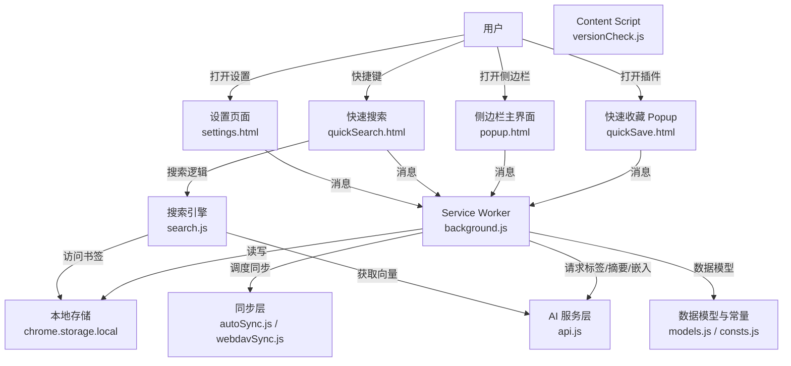

### 模块职责说明

- `manifest.json`：扩展入口、权限、快捷键、侧边栏与选项页配置
- `background.js`：Service Worker，负责消息分发、存储访问、同步调度与全局运行时逻辑
- `api.js`：AI 接口层，封装多种 AI 服务、Embedding 请求、标签/摘要生成逻辑
- `storageManager.js`：封装 Chrome Storage 读写、书签缓存、增删改查与变更通知
- `search.js`：语义搜索与关键词匹配，负责计算相似度、结果评分与排序
- `autoSync.js`：自动同步调度与闹钟管理
- `webdavSync.js`：WebDAV 同步实现层
- `settingsManager.js` / `syncSettingManager.js`：配置读取、验证与持久化
- `models.js`：书签数据模型定义、版本字段与兼容性处理
- `consts.js`：消息类型、默认参数与功能开关
- `logger.js`：统一日志输出接口
- `i18n.js`：国际化文本支持
- `build.py` / `build.sh`：打包与发布辅助脚本

---

## 🧩 核心业务流程

### 1. 书签保存流程

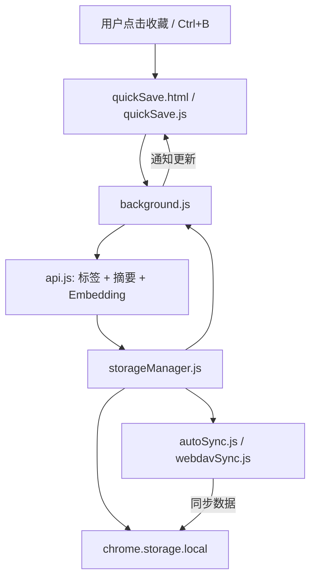

### 2. 语义搜索流程

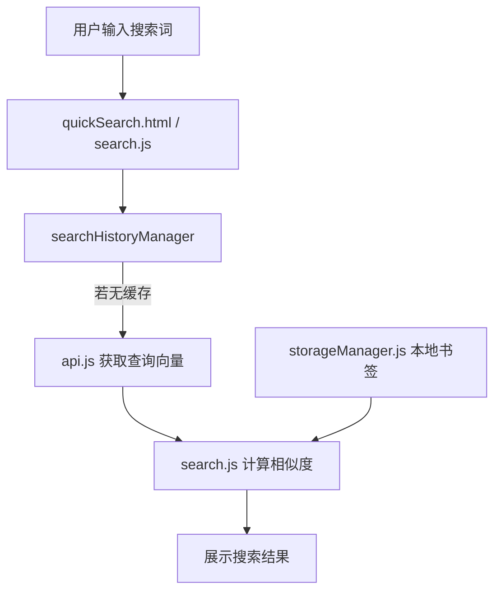

### 3. WebDAV 同步流程

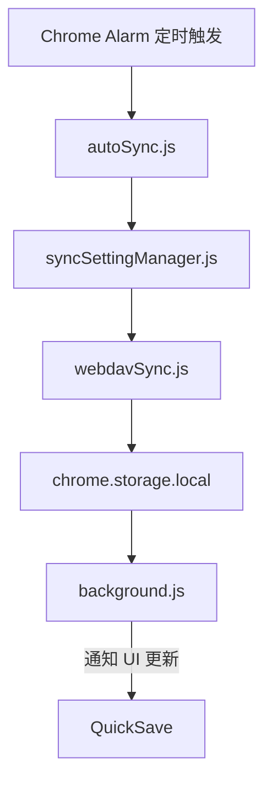

---

## 📁 代码目录说明

### 主要入口

- `quickSave.html` / `quickSave.js`：快速收藏弹窗
- `popup.html` / `popup.js`：侧边栏主界面
- `quickSearch.html` / `quickSearch.js`：快速搜索弹窗
- `settings.html` / `settings.js`：设置页面
- `intro.html` / `intro.js`：新用户引导页面

### 核心运行时

- `background.js`：Service Worker 执行入口
- `contentScript.js`：页面脚本注入（本项目当前仅用于本地测试域名）
- `versionCheck.js`：版本检查脚本

### 主要服务层

- `api.js`：AI 服务适配、Embedding 调用、标签与摘要生成
- `storageManager.js`：数据存储、书签 CRUD、缓存策略、消息通知
- `search.js`：搜索逻辑、向量相似度、关键词排序
- `autoSync.js`：自动同步调度、定时闹钟管理
- `webdavClient.js` / `webdavSync.js`：WebDAV 请求与数据同步实现
- `settingsManager.js` / `syncSettingManager.js`：配置读取、验证和同步
- `models.js`：统一书签数据模型定义
- `consts.js`：核心常量与功能开关定义
- `logger.js`：日志封装
- `i18n.js`：国际化文本支持
- `util.js`：公共工具函数
- `config.js` / `env.json`：本地环境与 API Key 配置
- `build.py` / `build.sh`：构建与打包脚本

---

## 🚀 快速开始

### 安装扩展

1. 克隆项目：

```bash
git clone https://github.com/howoii/SmartBookmark.git
cd SmartBookmark
```

2. 打开浏览器扩展页面：
   - Chrome: `chrome://extensions/`
   - Edge: `edge://extensions/`

3. 开启「开发者模式」，点击「加载已解压的扩展程序」，选择项目根目录。

### 本地开发

- 修改代码后，在扩展页面点击 `刷新`
- Service Worker 修改需要重新加载扩展
- 使用浏览器开发者工具查看 `logger.debug/info/error` 日志

### 本地配置

- 复制 `env.json` 并填写你的 AI API Key
- 将 `env.json` 保持为本地私密文件，不要提交到仓库

### 调试方法

- Popup 页面：右键插件图标 → 检查
- Service Worker：扩展页面 → Service Worker → 检查
- 设置页和快速搜索页面同样可在控制台调试

### 构建发布

```bash
# 手动打包
# 1. 删除 env.json 或确保敏感信息不包含在发布包中
# 2. 将项目目录压缩为 zip
# 3. 上传到 Chrome Web Store / Edge Add-ons
```

---

## 🧠 开发者须知

### 设计原则

- 所有浏览器存储访问集中在 `storageManager.js`
- 使用 `async/await` 保持异步逻辑清晰
- 使用 `logger.debug/info/error` 统一日志风格
- 界面与业务逻辑分离，UI 页面通过消息与后台交互
- 使用 `tagVersion` 管理数据模型变更与兼容性

### 关键实现点

- `api.js`：多 AI 服务支持、Embedding 批量分批、token 估算
- `search.js`：混合语义搜索与关键词匹配、余弦相似度评分
- `autoSync.js`：通过 `chrome.alarms` 调度同步任务
- `storageManager.js`：本地缓存、消息广播、写入通知与防抖更新

### 关键配置说明

- `manifest.json` 中声明：
  - `action.default_popup = quickSave.html`
  - `side_panel.default_path = popup.html`
  - `options_page = settings.html`
  - 权限：`tabs`, `storage`, `activeTab`, `scripting`, `sidePanel`, `bookmarks`, `unlimitedStorage`, `favicon`, `alarms`
  - 快捷键：`quick-search`, `quick-save`
  - `omnibox` 关键词：`sb`

---

## 🤝 贡献指南

欢迎任何开发者参与贡献。

### 代码贡献流程

1. Fork 本仓库
2. 新建分支：

```bash
git checkout -b feature/your-feature
```

3. 提交修改：

```bash
git commit -m "feat: 描述新增功能"
```

4. 推送分支并创建 Pull Request

### 提交规范

- `feat:` 新功能
- `fix:` Bug 修复
- `docs:` 文档更新
- `refactor:` 代码重构
- `style:` 代码格式调整
- `test:` 测试相关

### 问题反馈

- GitHub Issues：<https://github.com/howoii/SmartBookmark/issues>
- 请提供复现步骤、浏览器版本、截图或日志

---

## 📚 FAQ

### 支持哪些 AI 模型？

- OpenAI：`GPT-3.5-turbo`, `GPT-4`, `GPT-4-turbo`
- 通义千问：`qwen-turbo`, `qwen-plus`, `qwen-max`
- 智谱 GLM：`glm-3-turbo`, `glm-4`
- Ollama：本地模型（如 `llama2`, `mistral`）
- 自定义 API：兼容 OpenAI API 格式

### 数据存储在哪里？

- 书签数据存储在浏览器本地（`chrome.storage.local`）
- WebDAV 同步时，仅与用户配置的服务器交互
- 不会默认上传到第三方服务器

### 为什么需要 API Key？

- 语义搜索依赖 Embedding API
- AI 标签与摘要生成需要模型调用
- 你也可以选择使用本地 Ollama 模型，减少云服务依赖

### 如何导出书签？

1. 打开主界面
2. 点击右上角菜单
3. 选择「导出书签」
4. 支持 JSON / HTML 格式

### 插件占用多少存储空间？

- 插件本体：约 2MB
- 书签数据大小与数量相关，1000 个书签（含向量）约 10-20MB
- 已申请 `unlimitedStorage` 权限，可支持大规模书签存储

### 遇到问题怎么办？

1. 查看 README FAQ 是否已覆盖
2. 在 GitHub Issues 搜索相关问题
3. 如果问题未解决，请提交新 Issue

---

## 📬 联系方式

### 问题反馈

- GitHub Issues：<https://github.com/howoii/SmartBookmark/issues>
- Email：yz0917@foxmail.com

### 交流讨论

- 微信：
  

---

## 🙏 致谢

感谢所有参与贡献的开发者与用户，欢迎 Fork、优化与扩展本项目。

---

## 📄 License

本项目采用 [MIT 协议](LICENSE) 开源。

欢迎自由使用、修改和分发，但请保留原作者信息。

---

<div align="center">

**如果这个项目对你有帮助，欢迎 ⭐ Star 支持一下！**

[⬆ 回到顶部](#-smart-bookmark)

</div>
